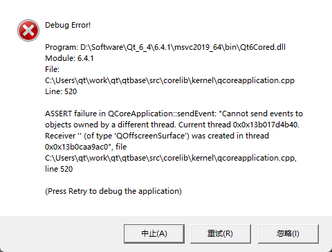

## 20221114
### confusion
- MinGW 在链接时是链接到 *.a 库引用文件，生成的可执行程序运行时依赖 *.dll，而 Linux/Unix 系统里链接时和运行时都是使用 *.so。
### something new
- Explicit Linking 和 Implicit Linking

    动态链接库通常都有其导出函数列表， 告知其他可执行程序可以使用它的哪些函数。可执行程序使用这些导出函数有两种方式：一是在运行时使用主动加载动态库的函数，Linux 里比如用 dlopen 函数打开并加载动态库，Windows 里一般用 LoadLibrary 打开并加载动态库，只有当程序代码执行到这些函数时，其参数里的动态库才会被加载，这就是显式链接。显式链接方式是在运行时加载动态库，其程序启动时并不检查这些动态库是否存在。

    隐式链接是最为常见的，所有的编译环境默认都是采用隐式链接的方式使用动态库。隐式链接会在链接生成可执行程序时就确立依赖关系，在该程序启动时，操作系统自动会检查它依赖的动态库，并一一加载到该程序的内存空间，程序员就不需要操心什么时候加载动态库了。比如 VC 编译环境，链接时使用动态库对应的 .lib 文件（包含动态库的导出函数声明，但没有实际功能代码），在 .exe 程序运行前系统会检查依赖的 .dll。

## 20221115
### confusion
- Qt属性系统
- 隐式共享
- 光栅化与片段插值

    这个图片可能不是你所期望的那种，因为我们只提供了3个颜色，而不是我们现在看到的大调色板。这是在片段着色器中进行的所谓片段插值(Fragment Interpolation)的结果。当渲染一个三角形时，光栅化(Rasterization)阶段通常会造成比原指定顶点更多的片段。光栅会根据每个片段在三角形形状上所处相对位置决定这些片段的位置。
    
    基于这些位置，它会插值(Interpolate)所有片段着色器的输入变量。比如说，我们有一个线段，上面的端点是绿色的，下面的端点是蓝色的。如果一个片段着色器在线段的70%的位置运行，它的颜色输入属性就会是一个绿色和蓝色的线性结合；更精确地说就是30%蓝 + 70%绿。

    这正是在这个三角形中发生了什么。我们有3个顶点，和相应的3个颜色，从这个三角形的像素来看它可能包含50000左右的片段，片段着色器为这些像素进行插值颜色。如果你仔细看这些颜色就应该能明白了：红首先变成到紫再变为蓝色。片段插值会被应用到片段着色器的所有输入属性上。
### something new
- connectSlotsByName(QWDialog) 函数将搜索 QWDialog 界面上的所有组件，将信号与槽函数匹配的信号和槽关联起来，它假设槽函数的名称是：
void on_<object name>_<signal name>(<signal parameters>);
- 一个信号可以连接多个槽, 当一个信号与多个槽函数关联时，槽函数按照建立连接时的顺序依次执行

  一个信号可以连接另外一个信号
- Qt元对象系统
- Qt属性系统
- 隐式共享

    正确代码
    ```c++
    const QList<int> sizes = splitter->sizes();
    QList<int>::const_iterator i;
    for (i = sizes.begin (); i != sizes.end(); ++i)
        ...
    ```
    错误代码
    ```c++
    QList<int>::const_iterator i;
    for (i = splitter->sizes().begin(); i != splitter->sizes().end(); ++i)
    ```
    错误的原因是，每次调用QSplitter::sizes()都返回一个新的QList<int>值，如果不存储这个值，C++在开始迭代之前就会自动将其销毁，而只留下一个浮动迭代器。更糟的是，每次循环运行由于都调用了splitter->sizes().end()，QSplitter::sizes()都必须生成一个新的列表的副本。总之，如果你使用STL风格迭代器，总是要在返回值的容器副本上进行遍历。而Java Style不需要，因为它自动生成了副本.


## 20221116
### confusion
- libopengl_world.so.4.0.6
    https://blog.csdn.net/ShareProgress/article/details/121561252


## 20221117
### confusion

### something new
- 不要把所有图片都放到Qt资源文件，否则会导致源代码过大
- 创建和清理mat空间
    ```
    Mat mat(3000, 4000, CV_8UC3);
    mat.create(rows, cols, CV_8UC1); //会把之前的内存清理掉
    release或者析构 引用计数为1时释放
    ```
- isContinuous

    判断存储空间是否连续
    
    通过step记录

## 20221118
### confusion
- 片段插值
- 指定多级渐远纹理的级别

### something new
- Visual Studio
    
    相对路径起点默认是vcxproj文件所在目录，如LearnOpenGL.vcxproj在E:\Visual_Studio\LearnOpenGL\LearnOpenGL下，则E:\Visual_Studio\LearnOpenGL\LearnOpenGL\src下的main.cpp中的
    "res/shaders/shader.vs"相当于"E:\Visual_Studio\LearnOpenGL\LearnOpenGL\res\shaders\shader.vs"

## 20221119
### confusion
- 
### something new
- 在静态库中最好不要去存放全局变量，也不要在这里创建单例对象等。如果对程序文件大小有要求，最好使用动态库。


## 20221120
### confusion
### something new
- C++11规定了local static在多线程条件下的初始化行为，要求编译器保证了内部静态变量的线程安全性


## 20221123
### confusion
### something new
- 编译ffmpeg，https://blog.csdn.net/DemoFY/article/details/127636507
sudo ./configure --enable-version3 --enable-gpl --enable-nonfree --enable-small --enable-libmp3lame --enable-libx264 --enable-libx265 --enable-libvpx --enable-libtheora --enable-libvorbis --enable-libopus --enable-libfdk-aac --enable-libass --enable-libwebp --enable-librtmp --enable-postproc --enable-libfreetype --enable-pthreads --enable-openssl --enable-shared --disable-debug --disable-doc --disable-ffplay 

## 20221202
### confusion
### something new
- 模板函数的声明与定义分离比较麻烦，主要有以下解决方法:
在声明处直接实现模板函数。
在使用模板函数的 cpp 文件中实现模板函数，不过多个文件中使用得分别实现，比较麻烦。
新建一个文件，网上一般会以.hpp 或者.tpp 作为后缀，实现模板函数，在使用处 include。
- 调用gl函数crash的一般原因是glad未初始化

## 20221203
### confusion
### something new
```c++
std::shared_ptr<Frame[]> f8(new Frame[10]());             // Error，管理动态数组时，需要指定删除器
  std::shared_ptr<Frame> f9(new Frame[10](), std::default_delete<Frame[]>());
```
- 设计模式最大的目的就是复用
- 面向对象设计最大的优势在于抵御变化
    - 隔离变化
    - 各司其职
    - 对象是拥有某种责任的抽象
- 设计原则
    - 依赖倒置原则（DIP）
        - 高层（稳定）不依赖底层（变化），二者依赖抽象（稳定）
        - 抽象不依赖于细节
        - (依赖默认是编译时依赖，A依赖B，即A必须有B才能编译通过，其他还有运行时依赖)

    - 开放封闭原则
        - 对扩展开放，对更改封闭，避免修改原有代码
        - 导致重新测试，重新编译，重新部署

    - 单一职责原则
        - 一个类应该仅有一个引起它变化的原因
        - 变化的方向隐含着类的责任
    - 替换原则
        - 子类必须能替换它们的基类
        - 继承表达类型抽象
    - 接口隔离原则
        - 不应强迫客户依赖它们不适用的方法
        - 接口应该小而完备
    - 优先使用对象组合，而不是类继承
    - 封装变化点
    - 针对接口编程，而不是针对实现编程

## 20221204
### confusion
### something new
- 模式分类 隔离变化，复用稳定
- 重构到设计模式
- 重构关键技法
    - 静态->动态
    - 早绑定->晚绑定
    - 继承->组合
    - 编译时依赖->运行时依赖
    - 紧耦合->松耦合
- 组件协作模式
    - Template Methor
    - Strategy
    - Observer/event
- 模式方法 Template Methor
    - 早绑定->晚绑定
    - 延迟到子类，支持子类的变化
    - 子类可以复用一个算法的接口(非虚函数)，也可以重写算法中的某些步骤(虚函数)
    - 不要调用我，让我来调用你
- 策略模式
    - 动态看程序，加时间轴
    - 复用指的是二进制级(编译单位)的复用，而不是原代码片段级的复用
    - 扩展增加新的子类，子类化
    - 看到if else或switch的时候考虑使用策略模式
    - 减少冗余判断，代码具有良好的本地性，CPU高速缓存
    - strategy对象一般可采用singleton

- 观察者模式
    - C++一般不推荐多继承，只推荐一种多继承模式，一个主继承类，其他都是接口类
    - 一对多
    - 自动通知
- 适配器模式
    - 接口隔离模式
    - 场景：将“现存对象”放在新的环境中应用
    - 老接口转换成新接口
    - adapter实现target，调用adaptee
- 工厂模式
    - 对象创建模式
    - 通过“对象创建模式”绕开new，避免对具体类的依赖
    - 多态new
    - 并没有彻底消除依赖，把变化限制在一个局部可控的地方
    - 把实例化延迟到子类（具体工厂类）
    - 工厂基类，具体工厂类
    - 产品创建方法/参数相同
- 抽象(家族)工厂模式
    - 创建一系列相互依赖的对象（数据库）

- 原型模式
    - 对象创建模式
    - 把产品和工厂合并
- QThread 子线程没有任何资格对窗口(ui)做任何的读写操作

## 20221205
### confusion

### conclusion
- 死锁
    - what? 多个进程（线程）在运行过程中因争夺资源而造成的一种僵局
    - why?
        - 竞争资源
            - 可剥夺资源：CPU和内存
            - 不可剥夺资源：打印机，磁带机，同一个变量
            - 竞争不可剥夺资源导致死锁
            - 竞争临时资源（临时资源包括硬件中断，信号，消息，缓冲区的消息）导致死锁
        - 进程间推进顺序非法
            - 若P1保持R1，但要请求R2，P2保持R2，但请求R1,继续推进则死锁
    - 死锁产生的四个必要条件
        - 互斥：请求的资源是互斥的
        - 请求和保持：线程因请求资源阻塞，但对已获得资源不释放
        - 不剥夺条件
        - 环路等待条件：线程-资源环形链
    - 解决死锁的基本方法
        - 资源一次性分配：一次性分配所有资源，无需请求
        - 只要有一个资源得不到分配，也不给这个进程分配其他的资源：（破坏请保持条件）？
        - 当线程得到部分资源，但得不到其它资源，则释放已有资源
        - 1. 以确定的顺序获得锁：有点麻烦，所有的锁都按照特定顺序获取，银行家算法
        - 2.超时放弃，tryLock


## 20221205
### confusion

### something new
- 装饰器模式
    - 单一职责模式
    - 过度使用继承去扩展功能（流-> 加密流 -> 缓冲加密流）会带来子类的膨胀
    - 组合优于继承
    - 运行时动态扩展对象功能
    - 接口上表现为is a，实现上表现为has a
- 桥模式
    - 将抽象部分（业务功能）与实现部分（平台实现）分离，使它们都可以独立地变化
    - 使用“对象间的组合关系”解耦了抽象和实现之间固有的绑定关系

- 原型模式
    - 
    - 模式定义：使用原型实例对象指定创建对象的种类，然后通过拷贝这些原型来创建新的对象

    - 克隆原型对象，不能使用原型对象
    - 针对某些结构复杂的对象
    - 创建的初始状态不是想要的
    - clone一个具有对应状态的对象
    - 保证深拷贝构造函数的正确性


## 20221207
### confusion
- 问题如下，解决方法是https://www.jianshu.com/p/dd33613360e0，需要再深入研究下


## 20221209
### confusion
### something new
- FFmpeg中AVPacket和AVFrame管理：https://blog.csdn.net/lidec/article/details/118998366


## 20221213
### confusion
### something new
- 单例模式
    - 抽象会带来代价（性能问题）
    - 双检查锁，但由于内存读写reorder不安全

- 享元模式
    - FlyWeight采用对象共享的做法降低系统中对象的个数
    - 要注意对象状态的处理，一般创建后状态不再改变
    - 运用共享计数有效地支持大量细粒度的对象

- 门面模式
    - 接口隔离模式
    - 添加一层间接接口，来隔离本来互相关联的接口
    - 为子系统中的一组接口提供一个一致（稳定）的界面，供外部用户依赖
- 构建器模式
    - 一个复杂对象的各个部分经常变化，但将它们组合起来（构建起来）的算法却是稳定的
    - C++中的构造和析构中函数时静态绑定，

## 202212114
- framedispathcer需要