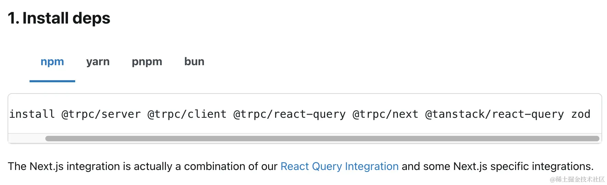

## 一、TRPC 简介

TRPC（Tiny Remote Procedure Call） 是一个专为全栈 TypeScript 开发人员设计的库，它允许你在前端和后端之间轻松地创建类型安全的 API 端点。由于 API 合约的类型错误会在构建时被捕获，因此可以降低应用程序在运行时出错的可能性。你可以在TRPC官方文档中找到更多关于如何配置和使用 TRPC 的信息。

TRPC官网：[trpc.io/docs/client…](https://link.juejin.cn/?target=https%3A%2F%2Ftrpc.io%2Fdocs%2Fclient%2Fnextjs%2Fsetup "https://trpc.io/docs/client/nextjs/setup")

## 二、安装依赖

首先，我们需要安装 TRPC 和其他相关依赖



```bash
npm install @trpc/server @trpc/client @trpc/react-query @trpc/next @tanstack/react-query zod
```

## 三、创建 TRPC 客户端

我们需要创建一个 TRPC 客户端，该客户端将用于在前端发起请求

```ts
// src/app/_trpc/client.ts import { AppRouter } from '@/trpc' import { createTRPCReact } from '@trpc/react-query' export const trpc = createTRPCReact<AppRouter>({})
```

这里需要的 `AppRouter` 类型将在后面创建。

## 四、创建 TRPC 路由

首先初始化一个tRPC服务器，并导出其路由器和过程函数以供后续使用。

```ts
// src/trpc/trpc.ts import { initTRPC } from '@trpc/server' const t = initTRPC.create() export const router = t.router export const publicProcedure = t.procedure
```

参考：

[trpc.io/docs/server…](https://link.juejin.cn/?target=https%3A%2F%2Ftrpc.io%2Fdocs%2Fserver%2Frouters "https://trpc.io/docs/server/routers")

[trpc.io/docs/server…](https://link.juejin.cn/?target=https%3A%2F%2Ftrpc.io%2Fdocs%2Fserver%2Fprocedures "https://trpc.io/docs/server/procedures")

接下来，我们需要创建 TRPC 路由。

```ts
//src/trpc/index.ts import { publicProcedure, router } from './trpc' export const appRouter = router({ test: publicProcedure.query(() => { return String(Math.random()) }), // ... }) // export type definition of API export type AppRouter = typeof appRouter
```

以上路由中定义了一个名为`test`的API方法，使用query用于查询，这里返回一个随机字符串，并且导出了相关的类型以确保类型安全。

## 五、创建 TRPC 提供者

接着，我们需要创建一个 TRPC 提供者，它将包裹我们的应用，并提供 TRPC 客户端和查询客户端。

```ts
//src/components/Providers.tsx 'use client' import { trpc } from '@/app/_trpc/client' import { QueryClient, QueryClientProvider } from '@tanstack/react-query' import { httpBatchLink } from '@trpc/client' import { PropsWithChildren, useState } from 'react' import { absoluteUrl } from '@/lib/utils' const Providers = ({ children }: PropsWithChildren) => { const [queryClient] = useState(() => new QueryClient()) const [trpcClient] = useState(() => trpc.createClient({ links: [ httpBatchLink({ url: absoluteUrl('/api/trpc'), }), ], }) ) return ( <trpc.Provider client={trpcClient} queryClient={queryClient}> <QueryClientProvider client={queryClient}>{children}</QueryClientProvider> </trpc.Provider> ) } export default Providers
```

然后，创建处理路由的工具函数

```ts
// src/lib/utils.ts export function absoluteUrl(path: string) { if (typeof window !== 'undefined') return path if (process.env.PRO_URL) return `${process.env.PRO_URL}${path}` return `http://localhost:${process.env.PORT ?? 3000}${path}` }
```

创建配置文件

-   `.env.local`
-   `env.example`
-   `.env`
-   `.env.production`

`example`和`production`添加以下内容，PRO\_URL仅需要在生产环境配置域名即可：

```ini
# 生产环境必填 PRO_URL="http://abc.com" # 端口 PORT="3000"
```

同时需要将`.env`和`.env.production`添加到git忽略文件

在你的布局组件中使用 `Providers` 组件：

```ts
// src/app/layout.tsx import Providers from '@/components/Providers' <Providers>{children}</Providers>
```

## 六、配置 TRPC 服务端

最后，我们需要在服务端托管 TRPC

```ts
// src/app/api/trpc/[trpc]/route.ts import { fetchRequestHandler } from '@trpc/server/adapters/fetch' import { appRouter } from '@/trpc' const handler = (req: Request) => fetchRequestHandler({ endpoint: '/api/trpc', req, router: appRouter, createContext: () => ({}), }) export { handler as GET, handler as POST }
```

## 七、在客户端发起 API 请求

现在，你可以在客户端发起 API 请求。例如，创建一个名为 `DashboardPage` 的新页面，并添加以下代码：

```ts
// src/app/dashboard/page.tsx 'use client' import { trpc } from '@/app/_trpc/client' const DashboardPage = () => { const { data } = trpc.test.useQuery() return ( <div> <p>Welcome to the dashboard!</p> <p>{data}</p> </div> ) } export default DashboardPage
```

现在，你应该可以在页面看到打印出的字符串。同时，你也可以看到 `data` 的类型提示为 `string | undefined`

在 TRPC 路由中，你可以直接操作数据库，进行各种 CRUD 操作。

## 八、重试策略

参考：

useQuery：[trpc.io/docs/client…](https://link.juejin.cn/?target=https%3A%2F%2Ftrpc.io%2Fdocs%2Fclient%2Freact%2FuseQuery "https://trpc.io/docs/client/react/useQuery")

useUtils：[trpc.io/docs/client…](https://link.juejin.cn/?target=https%3A%2F%2Ftrpc.io%2Fdocs%2Fclient%2Freact%2FuseUtils "https://trpc.io/docs/client/react/useUtils")

下面给出示例，如加载中，错误重试，重试

修改一下test API，让其有错误的可能

```ts
// src/trpc/index.ts import { publicProcedure, router } from './trpc' import { TRPCError } from '@trpc/server' export const appRouter = router({ test: publicProcedure.query(() => { const randomNumber = Math.random() if (randomNumber <= 0.7) { throw new TRPCError({ code: 'INTERNAL_SERVER_ERROR', message: 'Something went wrong', }) } else { return String(randomNumber) } }), // ... }) // export type definition of API export type AppRouter = typeof appRouter
```

客户端请求

```ts
// src/app/dashboard/page.tsx 'use client' import { trpc } from '@/app/_trpc/client' import { Button } from '@/components/ui/button' const DashboardPage = () => { const { data, isLoading } = trpc.test.useQuery() const utils = trpc.useUtils() return ( <div> <p>Welcome to the dashboard!</p> <p>{data}</p> <Button onClick={() => utils.test.invalidate()}> {isLoading ? 'Loading...' : 'Click me'} </Button> </div> ) } export default DashboardPage
```

默认失败了4次就停止访问了，这是为什么？

`trpc.getUserInfo.useQuery()` 是一个 React Query 的 hook。React Query 有一个默认的错误重试策略，当请求失败时，它会自动尝试重新请求。默认情况下，React Query 会尝试重新请求3次，如果所有的重试都失败，那么它会停止重试，并将错误返回给用户。

这种自动重试的策略对于处理临时的网络问题或者服务器问题是非常有用的。例如，如果服务器暂时无法响应，那么通过自动重试，我们可能可以在服务器恢复正常后获取到数据，而无需让用户手动刷新页面。然而，对于永久性的错误（例如，用户没有进行身份验证，因此收到了401错误），这种自动重试的策略可能不是非常有用，因为重试不太可能改变结果。

如果你不想让 React Query 在请求失败时自动重试，你可以在调用 `useQuery()` 方法时传入一个配置对象，简单的设置 `retry` 属性为 0或者false。例如：

```ts
const { data, isLoading } = trpc.test.useQuery(undefined, { retry: 0 })
```

这样，当请求失败时，React Query 就不会尝试重新请求。

`retry` 还可以使用函数来实现个性化的策略，如我们希望这种客户端的错误重试1次就可以了，服务端的错误可以多试几次

```typescript
// src/lib/utils.ts import { TRPCClientError } from '@trpc/client' const MAX_QUERY_RETRIES = 3 const SKIPPED_HTTP_CODES = [401, 402, 403, 404] export const reactQueryRetry = (failureCount: number, error: unknown) => { if ( error instanceof TRPCClientError && SKIPPED_HTTP_CODES.includes(error.shape?.data?.httpStatus ?? 0) ) { return failureCount < 1 } return failureCount < MAX_QUERY_RETRIES }
```

使用方法如下

```ts
import { reactQueryRetry } from '@/lib/utils' const { data, isLoading } = trpc.test.useQuery(undefined, { retry: reactQueryRetry, })
```

在使用重试时，isLoading并不会触发，需要使用isFetching，再次优化

```ts
const { data, isLoading, isFetching } = trpc.test.useQuery(undefined, { retry: reactQueryRetry, }) <Button onClick={() => utils.test.invalidate()}> {isFetching || isLoading ? 'Loading...' : 'Click me'} </Button>
```

现在，我们基本可以使用TRPC进行开发了，后面重点会讲到中间件的使用。