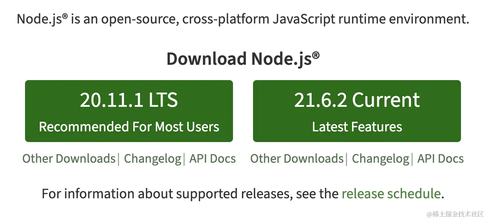
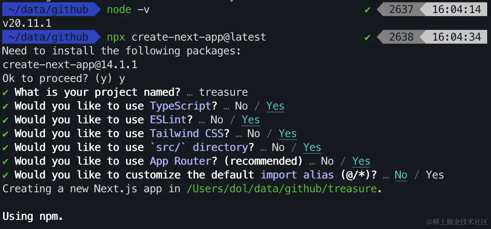
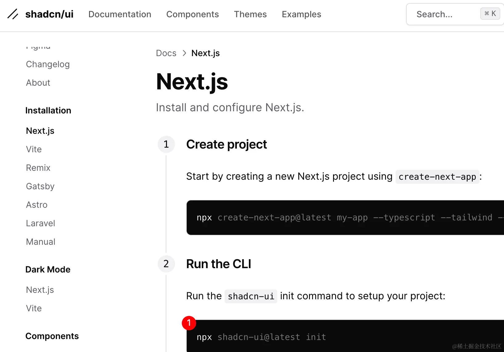
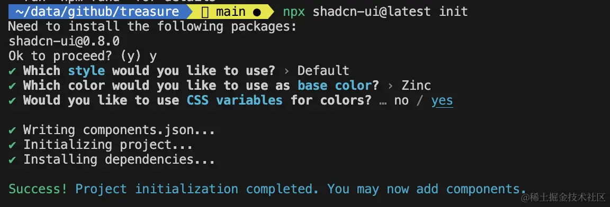
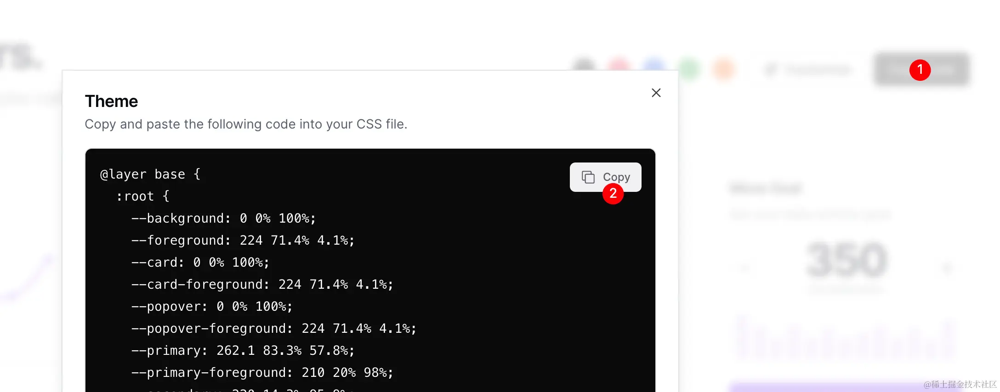

## 一、创建项目

首先，我们需要安装并设置 Node.js 的版本。使用 nvm（Node Version Manager）管理 Node可以方便地在不同版本之间切换。

node官网地址：[nodejs.org/en](https://link.juejin.cn/?target=https%3A%2F%2Fnodejs.org%2Fen "https://nodejs.org/en")



我们使用20.11.1长期支持维护的版本

```bash
nvm install 20.11.1 nvm alias default 20.11.1
```

淘宝镜像源加速

```bash
npm config set registry https://registry.npmmirror.com
```

然后，我们使用 Next.js 的命令行工具创建一个最新项目：

```bash
npx create-next-app@latest
```



如上图所示，Next.js已经到了14版本，在项目初始化阶段我们有一些可配置的选项。首先，项目名称是自定义的，根据需求进行设置。其次提供了TypeScript、esLint、Tailwind等可选的配置项，这些工具可以帮助提高代码质量和开发效率。

为了使项目的组织结构更清晰，推荐使用src目录。这种结构不仅方便了模块的解析，而且能提供更优秀的开发体验。

Next.js支持两种路由方式：使用应用路由（Using App Router）和使用页面路由（Using Pages Router）。在其官方文档中，根据需要切换查看这两种路由方式的相关内容。在我们的项目中，我们选择使用应用路由方式。

最后，关于导入别名的设置，我们使用默认配置`@/*`。这样的配置方式可以简化我们的代码，并提高代码的可读性。不需要进行任何更改，直接使用即可。

Next官网地址：[nextjs.org](https://link.juejin.cn/?target=https%3A%2F%2Fnextjs.org "https://nextjs.org")

## 二、配置 Prettier

nextjs官网提供了参考配置：

[nextjs.org/docs/app/bu…](https://link.juejin.cn/?target=https%3A%2F%2Fnextjs.org%2Fdocs%2Fapp%2Fbuilding-your-application%2Fconfiguring%2Feslint%23prettier "https://nextjs.org/docs/app/building-your-application/configuring/eslint#prettier")

Prettier 是一款强大的代码格式化工具，借用了 ESLint 的[覆盖格式](https://link.juejin.cn/?target=https%3A%2F%2Feslint.org%2Fdocs%2Flatest%2Fuser-guide%2Fconfiguring%2Fconfiguration-files%23how-do-overrides-work "https://eslint.org/docs/latest/user-guide/configuring/configuration-files#how-do-overrides-work")。我们可以在 Next.js 项目中配置它，以确保代码风格的一致性。首先，我们需要安装 Prettier 和 ESLint-Prettier ：

```bash
npm i -D prettier eslint-config-prettier
```

然后，我们需要在 `.eslintrc.json` 文件中添加 prettier：

```json
{ "extends": ["next/core-web-vitals", "prettier"] }
```

此外，我们还可以创建 `.prettierignore` 文件来指定哪些文件不需要被 Prettier 格式化：

```lua
.next dist node_modules
```

然后在项目的根目录下创建 `.prettierrc` 文件来自定义 Prettier 的配置：

```json
{ "trailingComma": "es5", "tabWidth": 2, "semi": false, "singleQuote": true }
```

下面是对各个配置项的解释：

-   `"trailingComma": "es5"`：这个配置项定义了是否在对象或数组的最后一个元素后面添加尾随逗号（trailing comma）。"es5"意味着在ES5中有效的地方添加尾随逗号，例如对象字面量、数组字面量等。
-   `"tabWidth": 2`：这个配置项定义了缩进的空格数。这里设置为2，表示每一级缩进使用两个空格。
-   `"semi": false`：这个配置项定义了是否在语句末尾添加分号。这里设置为false，表示不在语句末尾添加分号。
-   `"singleQuote": true`：这个配置项定义了是否使用单引号。这里设置为true，表示优先使用单引号。

Prettier官网：[prettier.io/docs/en/con…](https://link.juejin.cn/?target=https%3A%2F%2Fprettier.io%2Fdocs%2Fen%2Fconfiguration "https://prettier.io/docs/en/configuration")

最后，我们可以通过以下三种方式使用 Prettier：

1.  在 `package.json` 中配置一个 script 来手动格式化所有文件：

```json
"prettier": "prettier --write ."
```

2.  在 VS Code 中手动格式化文件，右键选择`使用...格式化文档`
3.  配置 VS Code 在保存文件时自动格式化。我们可以在 `.vscode/settings.json` 中添加以下配置：

```json
{ "editor.wordWrap": "on", "editor.formatOnSave": true, "editor.defaultFormatter": "esbenp.prettier-vscode" }
```

第一个配置选项为 `"on"` 时，VSCode 会在编辑器视图的右边缘处自动换行。这意味着你不需要水平滚动就可以看到所有的文本，因为所有的文本都会适应你的编辑器窗口的宽度，后面两个是保存后使用prettier格式化

VSCode需要安装两个插件，分别为`ESLint`和`Prettier - Code formatter`

## 三、配置主题

首先在nextjs中执行shadcn的初始化设置

shadcn地址：[ui.shadcn.com/docs/instal…](https://link.juejin.cn/?target=https%3A%2F%2Fui.shadcn.com%2Fdocs%2Finstallation%2Fnext "https://ui.shadcn.com/docs/installation/next")



根据提示，运行shadcn-ui init命令设置项目

```bash
npx shadcn-ui@latest init
```



初始化过程会有哪些改动？

-   自动安装需要的包，class-variance-authority，clsx，lucide-react，tailwind-merge，tailwindcss-animate
-   创建了一个包含以上选项的配置文件`components.json`
-   更新了`global.css`，增加了详细的主题配置
-   更新了`tailwind.conf.ts`，使得主题配置能在组件内生效
-   在`@/lib/utils`增加了cn方法，用于合并tailwind的样式

接下来我们可以在shadcn选择一个主题配置并将其应用到我们的 Next.js 项目中

主题地址：[ui.shadcn.com/themes](https://link.juejin.cn/?target=https%3A%2F%2Fui.shadcn.com%2Fthemes "https://ui.shadcn.com/themes")

设置好配色后拷贝代码，在`global.css`中替换对应的样式，如我在这里选择了violet（紫罗兰色），然后进行替换，另外，选择某个主题后对应的颜色如果有不满意的可以自行在`global.css`替换相应的值



然后，我们可以将选定的主题配置添加到 `global.css` 文件中。注意，我们应该保留所有与 Tailwind CSS 相关的样式，并替换掉其他的样式。

## 四、更新默认样式

在全局`global.css`增加质感和滚动条样式

```css
.grainy { background-image: url(); } .scrollbar-w-2::-webkit-scrollbar { width: 0.25rem; height: 0.25rem; } .scrollbar-track-blue-lighter::-webkit-scrollbar-track { --bg-opacity: 0.5; background-color: #00000015; } .scrollbar-thumb-blue::-webkit-scrollbar-thumb { --bg-opacity: 0.5; background-color: #13131374; } .scrollbar-thumb-rounded::-webkit-scrollbar-thumb { border-radius: 7px; }
```

接下来更新layout的默认样式，这样整个页面就会有颗粒状质感的背景，我们可以合并函数来完成样式：

```ts
import { cn } from '@/lib/utils' <html lang="en" className='light'> <body className={cn( 'min-h-screen font-sans antialiased grainy', inter.className )}>{children}</body> </html>
```

此外，我们可以定义一个顶层组件来封装公共的样式。例如，我们可以在 `src/components/MaxWidthWrapper.tsx` 中定义一个 `MaxWidthWrapper` 组件：

```ts
import { cn } from '@/lib/utils' import { ReactNode } from 'react' const MaxWidthWrapper = ({ className, children, }: { className?: string children: ReactNode }) => { return ( <div className={cn('mx-auto w-full max-w-screen-xl px-2.5 md:px-20', className)}> {children} </div> ) } export default MaxWidthWrapper
```

在页面中，我们可以这样使用 `MaxWidthWrapper` 组件：

```ts
import MaxWidthWrapper from "@/components/MaxWidthWrapper"; export default function Home() { return ( <MaxWidthWrapper className='mb-12 mt-28 sm:mt-40 flex flex-col items-center justify-center text-center'> hello world </MaxWidthWrapper> ) }
```

## 五、自定义Tailwind

Tailwind CSS 是一个实用的 CSS 框架，它可以帮助我们快速构建现代的网页界面。首先，我们需要安装两个插件

这个配置文件定义了一些自定义的主题颜色、边框半径、关键帧动画等，同时兼容了即将使用的组件库，使我们的主题在组件库生效。例如，我们还可以继续添加一些原生不支持的属性，以旋转为例，rotate属性，原生支持45度的值，现在你想旋转17度，那么就需要自定义

```ts
module.exports = { theme: { extend: { rotate: { '17': '17deg', } } } }
```

然后在组件中使用两者，都将支持

```ts
<div className="rotate-45"></div> <div className="rotate-17"></div>
```

## 六、使用图标

我们使用 Lucide 图标库，首先安装它：

图标库：[lucide.dev/](https://link.juejin.cn/?target=https%3A%2F%2Flucide.dev%2F "https://lucide.dev/")

```bash
npm i lucide-react
```

示例代码：

```ts
import { ArrowRight } from 'lucide-react' <ArrowRight className="ml-2 h-5 w-5" />
```

## 七、使用组件

我们添加 `button` 组件测试

```bash
npx shadcn-ui@latest add button
```

该命令会在src/components/ui/button.tsx生成一个按钮组件

然后，我们可以在页面中使用 `Button` 组件：

```ts
import MaxWidthWrapper from '@/components/MaxWidthWrapper' import Link from 'next/link' import { Button, buttonVariants } from '@/components/ui/button' import { ArrowRight } from 'lucide-react' export default function Home() { return ( <MaxWidthWrapper className="mb-12 mt-28 sm:mt-40 flex flex-col items-center justify-center text-center"> <Link className={buttonVariants({ size: 'lg', className: 'mt-5', })} href="/dashboard" > Get started <ArrowRight className="ml-2 h-5 w-5" /> </Link> <Button className="mt-4">Click me</Button> </MaxWidthWrapper> ) }
```


以上，就完成了初始化和基础配置

## 八、严格模式

[nextjs.org/docs/pages/…](https://link.juejin.cn/?target=https%3A%2F%2Fnextjs.org%2Fdocs%2Fpages%2Fapi-reference%2Fnext-config-js%2FreactStrictMode "https://nextjs.org/docs/pages/api-reference/next-config-js/reactStrictMode")

Good to know: Since Next.js 13.4, Strict Mode is `true` by default with `app` router, so the above configuration is only necessary for `pages`. You can still disable Strict Mode by setting `reactStrictMode: false`.

## 九、配置tsconfig

修改tsconfig.json配置

`baseUrl`选项用于设置模块解析的基准目录。这对于非相对模块的导入非常有用，因为它指定了TypeScript解析器查找模块的根目录

```json
"target": "es5", "baseUrl": "./",
```